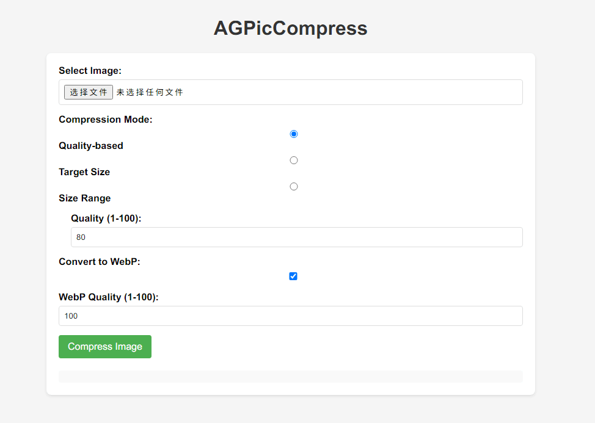

# AGPicCompress

[简体中文](./README.md) | English

AGPicCompress is a Python project for image compression, supporting JPEG and PNG formats.

## Introduction

- For JPEG images, AGPicCompress uses mozjpeg for compression.

- For PNG images, AGPicCompress uses pngquant for compression.

Both methods can reduce file size while maintaining visual quality, ensuring that the compressed images are visually indistinguishable or even losslessly compressed.

### Efficiency and Features

- Support batch processing
- Support exporting images in WebP format

AGPicCompress can be used completely offline. All image compression is done locally.

AGPicCompress uses a combination of algorithms and parameter configurations to minimize image file size while maintaining image quality as much as possible, meeting users' needs for image compression.

|  JEPG Presentation (Before Compression) Size: 9.61MB  |  JEPG Presentation (After Compression) Size: 1.79MB   |
|:---------------------------------------------------------------------------------------------:|:-------------------------------------------------------------------------------------------------------------------:|
| **PNG Presentation (Before Compression) Size: 45.1MB** | **PNG Presentation (After Compression) Size: 10.3MB** |

The above shows the comparison between the original and compressed JPEG and PNG images with default parameters. You can open or download the images to see the difference in quality and size.

## Getting Started

### Setup and Installation

You can follow the instructions below to install and configure AGPicCompress for image compression in your local environment.

#### Prerequisites

AGPicCompress depends on mozjpeg and pngquant.

You may need to install pngquant manually. You can refer to the [official pngquant documentation](https://pngquant.org/) and add it to the appropriate location.

AGPicCompress will check for the existence of pngquant at the following locations, which you can configure freely:
- Environment variables (recommended)
- Under the AGPicCompress directory
- Under the `ext` directory in the AGPicCompress directory

This allows AGPicCompress to find pngquant and use it for PNG image compression.

#### Getting the Code

You can obtain the code for the AGPicCompress project using the following methods:

```shell
git clone https://github.com/aoguai/AGPicCompress
cd AGPicCompress ## enter the AGPicCompress directory
pip install -r requirements.txt # install Python helpers' dependencies
```

#### Running

You can run the AGPicCompress project using the following methods:

1. Using the command line
    ```shell
    cd AGPicCompress ## enter the AGPicCompress directory
    python ImageCompressor.py <input_file> -o <output_file> -q <quality>
    ```
    You can also use the command
    ```shell
    cd AGPicCompress ## enter the AGPicCompress directory
    python ImageCompressor.py --help
    ```
    to view more help information.

---

2. Starting the Web Demo server
    ```shell
    cd AGPicCompress ## enter the AGPicCompress directory
    python backend/main.py
    ```
    Then access the corresponding address, with the default address being `http://localhost:8089/`
    

---

3. Using function calls
    ```python
    from ImageCompressor import compress_image
    compress_image(input_file, output_file, quality)
    ```
   Please refer to the `compress_image` function in `ImageCompressor.py` for details.

#### GUI and Executable File Instructions

AGPicCompress also provides executable files for the Windows environment. Windows users can directly download the executable files and follow the instructions to conveniently complete image compression tasks.

You can use `AGPicCompress --help` to obtain relevant CLI parameter information and help:
```angular2html
Usage: AGPicCompress [OPTIONS] FP                                        

  Compress images via command line.

  :param fp: Image file path or directory path. :type fp: Path

  :param force: Whether to overwrite if a file with the same name exists,
  defaults to False. :type force: bool

  :param quality: Compression quality. 80-90, or 90, default is 80. :type
  quality: int or tuple[int, int]

  :param output: Output path or output directory. :type output: str

  :param webp: Convert images to WebP format. :type webp: bool

Options:
  -f, --force, --violent        Whether to overwrite if a file with the same
                                name exists, defaults to False.
  -q, --quality QUALITYINTEGER  Compression quality. 80-90, or 90, default is
                                80.
  -o, --output TEXT             Output path or output directory.
  --webp                        Convert images to WebP format.
  --help                        Show this message and exit.
```

## Related

Thanks to the following open source projects for their support of AGPicCompress:

- [mozjpeg](https://github.com/mozilla/mozjpeg)
- [pngquant](https://github.com/kornelski/pngquant)
- [mozjpeg-lossless-optimization](https://github.com/wanadev/mozjpeg-lossless-optimization)

My related open source projects:

- [LiYing](https://github.com/aoguai/LiYing)

AGPicCompress was originally part of the project

## Contributing

AGPicCompress is an open-source project that appreciates all community involvement. To contribute to the project, follow the [contribute guide](./CONTRIBUTING.md).

## License

[AGPicCompress](https://github.com/aoguai/AGPicCompress) is open source under the GPL-3.0 license. Please refer to the [LICENSE](../LICENSE) file for more details.