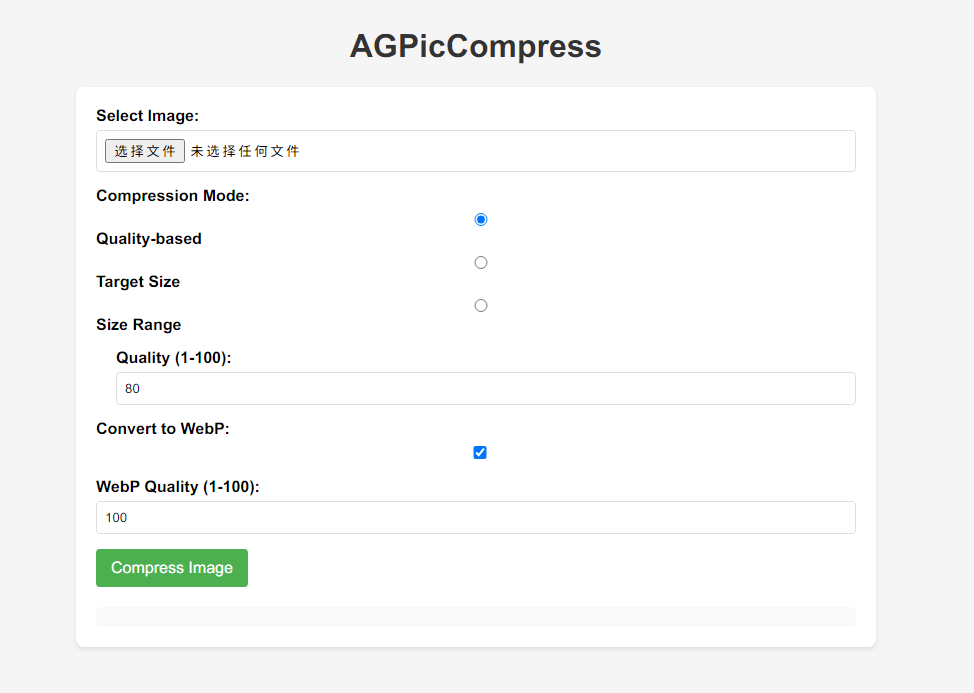

# AGPicCompress

简体中文 | [English](./README-EN.md)

AGPicCompress 是一个用于图片压缩的 Python 项目，支持 JPEG 和 PNG 格式的图片压缩。

## 介绍

- 对于 JPEG 图片，AGPicCompress 使用 mozjpeg 进行压缩

- 对于 PNG 图片，AGPicCompress 使用 pngquant 进行压缩

二者都可以在保证视觉质量的前提下减小文件大小，以保证压缩后的图片在肉眼上无差异，甚至无损压缩。

### 效率与特点

- 支持批量处理
- 支持导出图片成 WebP 格式

AGPicCompress 可以完全离线运行。所有图像压缩都在本地处理。

AGPicCompress 通过合理的算法选择和参数配置，能够在减小图片文件大小的同时尽可能地保持图片质量，满足用户对图片压缩的需求。

|  JEPG 效果展示(压缩前)大小：9.61MB  |  JEPG 效果展示(压缩后)大小：1.79MB   |
|:-----------------------------------------------------------------:|:----------------------------------------------------------------------------------------:|
| **PNG 效果展示(压缩前)大小：45.1MB** | **PNG 效果展示(压缩后)大小：10.3MB** |

上面分别是 JPEG 和 PNG 图片在默认参数下的压缩前后对比，你可以打开或者下载图片查看效果于大小差异。


## 开始

### 设置和安装

您可以按照以下说明进行安装和配置，从而在本地环境中使用 AGPicCompress 进行图片压缩。

#### 先决条件

AGPicCompress 需要依赖于 mozjpeg 和 pngquant

其中你可能需要手动安装 pngquant，你可以参考 [pngquant 官方文档](https://pngquant.org/)并将其添加到对应位置

AGPicCompress 会在以下位置检测 pngquant 是否存在，你可以自由配置
- 环境变量（推荐）
- AGPicCompress 目录下
- AGPicCompress 目录下的 `ext` 目录

以便 AGPicCompress 能够找到 pngquant 并使用它进行 PNG 图片的压缩

#### 获取代码

您可以通过以下方式获取 AGPicCompress 项目的代码：

```shell
git clone https://github.com/aoguai/AGPicCompress
cd AGPicCompress ## 进入 AGPicCompress 目录
pip install -r requirements.txt # install Python helpers' dependencies
```

#### 运行

您可以通过以下方式运行 AGPicCompress 项目：

1. 使用命令行
    ```shell
    cd AGPicCompress ## 进入 AGPicCompress 目录
    python ImageCompressor.py <input_file> -o <output_file> -q <quality>
    ```
    同时你可以通过
    ```shell
    cd AGPicCompress ## 进入 AGPicCompress 目录
    python ImageCompressor.py --help
    ```
    查看更多帮助信息

---

2. 启动 Web Demo 服务
    ```shell
    cd AGPicCompress ## 进入 AGPicCompress 目录
    python backend/main.py
    ```
    然后访问对应的地址使用，默认地址为 `http://localhost:8089/`
    

---

3. 使用函数调用
    ```python
    from ImageCompressor import compress_image
    compress_image(input_file, output_file, quality)
    ```
   具体请参考 `ImageCompressor.py` 中的 `compress_image` 函数

#### GUI 与 可执行文件说明

AGPicCompress 项目还提供了 Windows 环境下的可执行文件，Windows 用户可以直接下载可执行文件并按照说明进行使用，便捷地完成图片压缩任务。

你可以通过 AGPicCompress --help 来获取相关 CIL 参数信息与帮助
```angular2html
Usage: ImageCompressor.py [OPTIONS] FP

  通过命令行压缩图像。

  :param fp: 图像文件路径或目录路径。 :type fp: str

  :param force: 如果存在同名文件是否覆盖，默认为 False。 :type force: bool

  :param quality: 压缩质量。格式如 80-90 或 90，默认为 80。 :type quality: int or tuple[int, int]

  :param output: 输出路径或输出目录。 :type output: str

  :param webp: 转换图像为 WebP 格式，默认为 False。 :type webp: bool

  :param target_size: 目标文件大小（单位：KB）。指定后将忽略质量参数。 :type target_size: int or None

  :param size_range: 文件大小的最小值和最大值（单位：KB）。尝试在保持质量的同时确保文件大小在范围内。 :type size_range: tuple(int, int) or None

Options:
  -f, --force, --violent        如果存在同名文件是否覆盖，默认为 False。
  -q, --quality QUALITYINTEGER  压缩质量。80-90 或 90，默认为 80。
  -o, --output TEXT             输出路径或输出目录。
  --webp                        转换图像为 WebP 格式，默认为 False。
  -t, --target-size INTEGER     目标文件大小（单位：KB）。指定后将忽略质量参数。
  -s, --size-range INTEGER...   文件大小的最小值和最大值（单位：KB）。尝试在保持质量的同时确保文件大小在范围内。
  --help                        显示帮助信息。
```

## 相关

感谢以下开源项目对 AGPicCompress 的支持：

- [mozjpeg](https://github.com/mozilla/mozjpeg)
- [pngquant](https://github.com/kornelski/pngquant)
- [mozjpeg-lossless-optimization](https://github.com/wanadev/mozjpeg-lossless-optimization)

我的相关开源项目：

- [LiYing](https://github.com/aoguai/LiYing)

AGPicCompress 原属于该项目的一部分

## 贡献

AGPicCompress 是一个开源项目，非常欢迎社区的参与。要为该项目做出贡献，请遵循[贡献指南](./CONTRIBUTING.md)。

## License 说明

[AGPicCompress](https://github.com/aoguai/AGPicCompress) 使用 GPL-3.0 license 进行开源，详情请参阅 [LICENSE](../LICENSE) 文件。
